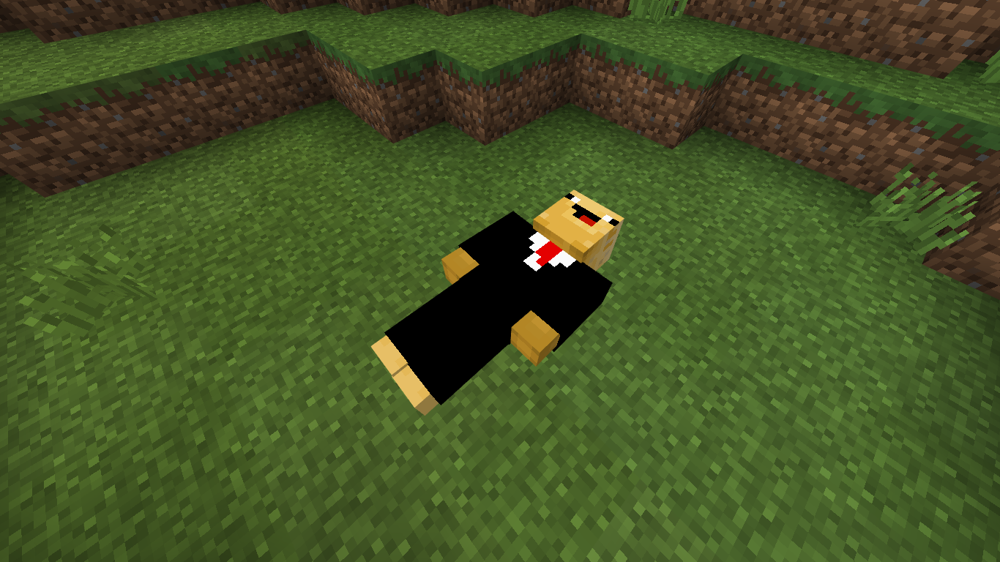

# Gravestones
Spawn a gravestone with your stuff when you die

| Phar | View Count |
| :---: | :---: |
  |  |
 
 ## Example
 
 
 ## Features
 
 - [x] Spawns a sleeping player
 - [x] Gravestone holds all items of the players inventory
 - [x] Gravestone has 1 HP
  
## TODO

 - [ ] Config
   - [ ] Gravestone display name
   - [ ] Gravestone HP